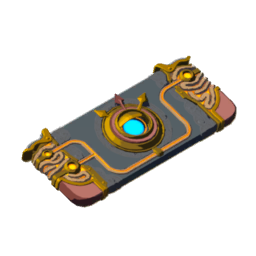

<!-- Improved compatibility of back to top link: See: https://github.com/othneildrew/Best-README-Template/pull/73 -->

<a id="readme-top"></a>

<!--
*** Thanks for checking out the Best-README-Template. If you have a suggestion
*** that would make this better, please fork the repo and create a pull request
*** or simply open an issue with the tag "enhancement".
*** Don't forget to give the project a star!
*** Thanks again! Now go create something AMAZING! :D
-->

<!-- PROJECT SHIELDS -->
<!--
*** I'm using markdown "reference style" links for readability.
*** Reference links are enclosed in brackets [ ] instead of parentheses ( ).
*** See the bottom of this document for the declaration of the reference variables
*** for contributors-url, forks-url, etc. This is an optional, concise syntax you may use.
*** https://www.markdownguide.org/basic-syntax/#reference-style-links
-->

![Last commit][last-commit]
![Commit activity][commit-activity]
![languages][languages]
![stars][stars-shield]
![MIT License][license-shield]

<!-- PROJECT LOGO -->
<br />
<div align="center">
  <a href="https://github.com/4very/purah">
    
  </a>

  <h3 align="center">Purah</h3>

  <p align="center">
    A whimsical photo portfolio, and bird catalogue.
    <br />
    <!-- <a href="https://github.com/othneildrew/Best-README-Template"><strong>Explore the docs »</strong></a> -->
    <br />
    <br />
    <!-- <a href="https://github.com/othneildrew/Best-README-Template">View Demo</a> -->
    <!-- <a href="https://github.com/othneildrew/Best-README-Template/issues/new?labels=bug&template=bug-report---.md">Report Bug</a> -->
    <!-- <a href="https://github.com/othneildrew/Best-README-Template/issues/new?labels=enhancement&template=feature-request---.md">Request Feature</a> -->
  </p>
</div>

<!-- TABLE OF CONTENTS -->
<!-- <details>
  <summary>Table of Contents</summary>
  <ol>
    <li>
      <a href="#about-the-project">About The Project</a>
      <ul>
        <li><a href="#built-with">Built With</a></li>
      </ul>
    </li>
    <li>
      <a href="#getting-started">Getting Started</a>
      <ul>
        <li><a href="#prerequisites">Prerequisites</a></li>
        <li><a href="#installation">Installation</a></li>
      </ul>
    </li>
    <li><a href="#usage">Usage</a></li>
    <li><a href="#roadmap">Roadmap</a></li>
    <li><a href="#contributing">Contributing</a></li>
    <li><a href="#license">License</a></li>
    <li><a href="#contact">Contact</a></li>
    <li><a href="#acknowledgments">Acknowledgments</a></li>
  </ol>
</details> -->

<!-- ABOUT THE PROJECT -->

## About The Project

[![Product Name Screen Shot][product-screenshot]](https://github.com/4very/purah)

<!-- <p align="right">(<a href="#readme-top">back to top</a>)</p> -->

### Built With

- [![Nuxt][Nuxt.js]][Nuxt-url]
- [![Vue][Vue.js]][Vue-url]
- [![Vite][Vite]][Vite-url]
- [![Vitest][Vitest]][Vitest-url]

- [![Strapi][Strapi]][Strapi]
- [![React][React.js]][React-url]

<p align="right">(<a href="#readme-top">back to top</a>)</p>

<!-- GETTING STARTED -->

## Getting Started

### Prerequisites

### Installation

#### Build Strapi docker file

```sh
# build docker file
cd strapi
docker-build.sh
```

#### Install dependencies

```sh
yarn install
```

### Running

```sh
docker-compose up

# in another terminal
yarn dev
```

### Testing

```sh
yarn test:ui
```

<p align="right">(<a href="#readme-top">back to top</a>)</p>

<!-- MARKDOWN LINKS & IMAGES -->
<!-- https://www.markdownguide.org/basic-syntax/#reference-style-links -->

[last-commit]: https://img.shields.io/github/last-commit/4very/purah?style=for-the-badge
[commit-activity]: https://img.shields.io/github/commit-activity/m/4very/purah?style=for-the-badge
[languages]: https://img.shields.io/github/languages/count/4very/purah?style=for-the-badge
[stars-shield]: https://img.shields.io/github/stars/4very/purah?style=for-the-badge
[license-shield]: https://img.shields.io/github/license/4very/purah?style=for-the-badge
[product-screenshot]: docs/assets/screenshot1.png
[Nuxt.js]: https://img.shields.io/badge/Nuxt-002E3B?style=for-the-badge&logo=nuxtdotjs&logoColor=#00DC82
[Nuxt-url]: https://nuxt.com/
[React.js]: https://img.shields.io/badge/React-20232A?style=for-the-badge&logo=react&logoColor=61DAFB
[React-url]: https://reactjs.org/
[Vue.js]: https://img.shields.io/badge/Vue.js-35495E?style=for-the-badge&logo=vuedotjs&logoColor=4FC08D
[Vue-url]: https://vuejs.org/
[Strapi]: https://img.shields.io/badge/strapi-%232E7EEA.svg?style=for-the-badge&logo=strapi&logoColor=white
[Strapi-url]: https://strapi.io/
[Vite]: https://img.shields.io/badge/vite-%23646CFF.svg?style=for-the-badge&logo=vite&logoColor=white
[Vite-url]: https://vitejs.dev/
[Docker]: https://img.shields.io/badge/docker-%230db7ed.svg?style=for-the-badge&logo=docker&logoColor=white
[Docker-url]: https://docker.com/
[Vitest]: https://img.shields.io/badge/vitest-%236E9F18?style=for-the-badge&logo=vitest&logoColor=white
[Vitest-url]: https://vitest.dev
